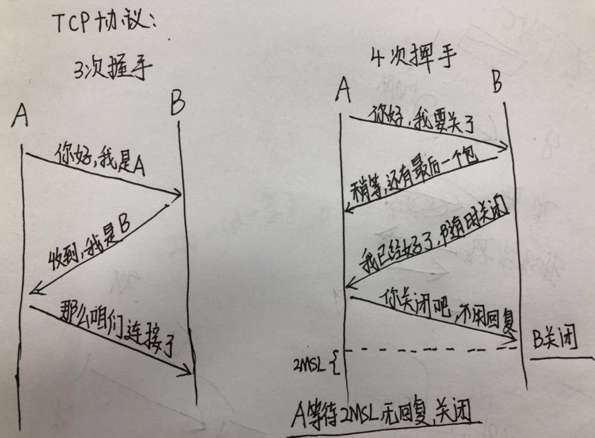

###Http2 多路复用
在HTTP/1中，每次请求都会建立一次TCP链接，也就是我们常说的三次握手4次挥手，在这一次请求过程中占用了相当长的时间，即使是开启了Keep-Alive, 解决了多次连接的问题，但是依然有个效率的问题：  
  - 第一个：串行的文件传输，当请求a文件时，b文件只能等待，等待a连接服务器、服务器处理文件、服务器返回文件，这三个步骤。我们假设这三个步骤都是1秒，那么a文件用时为3秒，b文件传输完成需要6秒，以此类推。（注：此项计算有一个前提，就是浏览器和服务器时单通道传输）
  - 第二个：连接数过多，我们假设Apache设置了最大并发数为300，因为浏览器限制，浏览器发起的最大请求数为6（Chrome），也就是服务器能承载的最高并发为50，当第51个人访问时，就是需要等待前面的某个请求处理完成。

HTTP2采用二进制传输格式，取代了HTTP1.x的文本格式，二进制格式解析更高效。多路复用代替了HTTP1.x的序列和阻塞机制，所有的相同域名请求都通过同一个TCP连接并发完成。在HTTP1.x中，并发多个请求需要多个TCP连接，浏览器为了控制资源会有6-8个TCP连接都限制。HTTP2中  
  - 同域名下所有通信都在单个连接上完成，消除了因多个TCP连接而带来的延时和内存消耗。  
  - 单个连接上可以并行交错的请求和响应，之间互不干扰。

###TCP三次握手
